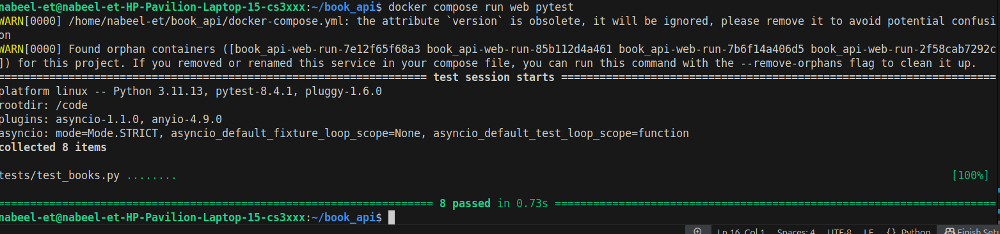

# 📚 FastAPI Book Manager

A modern RESTful **Book Catalog API** built with **FastAPI**, **SQLAlchemy**, and **Docker**. Manage books efficiently with full **CRUD** functionality, proper validations, and clean design.  

---

## ✨ Features

- 🔹 Create, Read, Update, Delete (CRUD) books
- 🔹 Data validation with Pydantic
- 🔹 Auto-generated interactive docs (Swagger & ReDoc)
- 🔹 Modular structure with routers, schemas, models, and crud layers
- 🔹 🧪 Unit tested with Pytest
- 🔹 Dockerized for consistency across environments

> **Unique Feature**:  
✅ Automatic validation & clean error handling powered by **Pydantic + FastAPI**—invalid requests return helpful error messages instantly!

---

## 🛠️ Setup Instructions

### ▶️ Option 1: Docker (Recommended)

```bash
git clone https://github.com/syedowaisalishah/book_api.git
cd book_api
docker compose up --build
```
📡 The API will be live at:
http://localhost:9010

### ▶️ Option 2: Run Locally (Python)
Make sure you have Python 3.11+ and pip installed
```bash
git clone https://github.com/syedowaisalishah/book_api.git
cd book_api
python -m venv venv
source venv/bin/activate
pip install -r requirements.txt
uvicorn app.main:app --reload --port 9010
```
### 📚 API Documentation
| Method   | Endpoint           | Description       |
| -------- | ------------------ | ----------------- |
| `GET`    | `/books/`          | List all books    |
| `GET`    | `/books/{book_id}` | Get book by ID    |
| `POST`   | `/books/`          | Create a new book |
| `PUT`    | `/books/{book_id}` | Update a book     |
| `DELETE` | `/books/{book_id}` | Delete a book     |


📘 Swagger UI → http://localhost:9010/docs
📘 ReDoc → http://localhost:9010/redoc

### 🧪 Running Tests
```bash
docker compose run web pytest
```
#### You should see:


### 🔗 Project Structure
```
book_api/
├── app/
│   ├── crud.py
│   ├── db.py
│   ├── main.py
│   ├── routers/
│   │   └── books.py
│   ├── schemas.py
│   └── sqlmodels.py
├── tests/
│   └── test_books.py
├── Dockerfile
├── docker-compose.yml
├── requirements.txt
└── README.md
```
### 👨‍💻 Author
Syed Owais Ali Shah
📫 syedowaisalishah@gmail.com
🔗 GitHub | LinkedIn

### 📄 License
This project is licensed under the MIT License.
